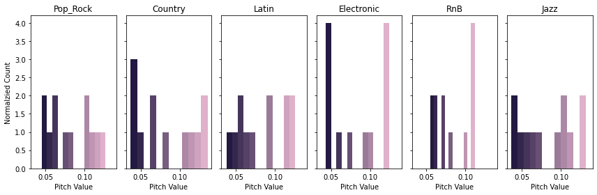
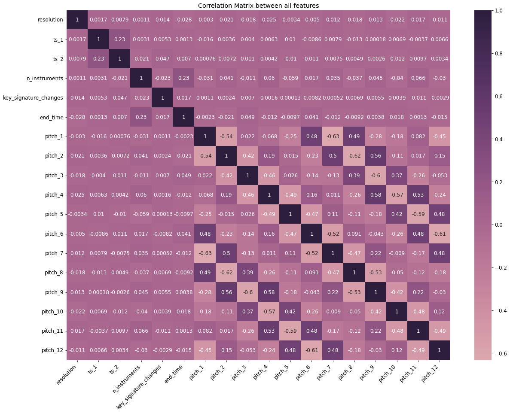
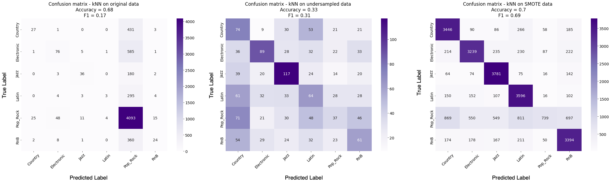
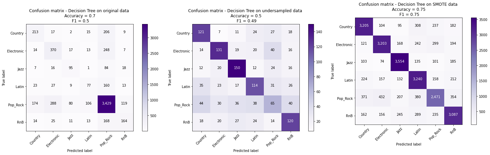
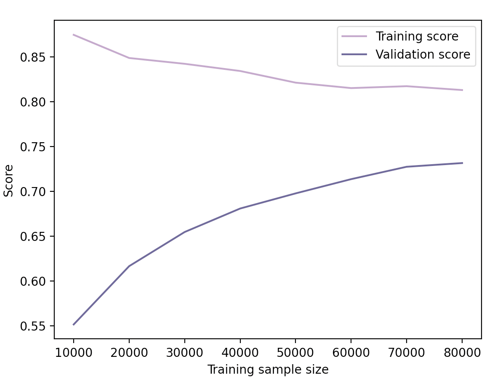
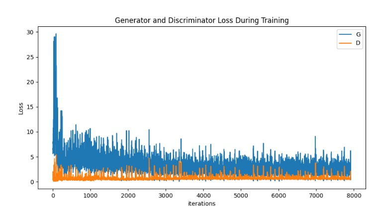
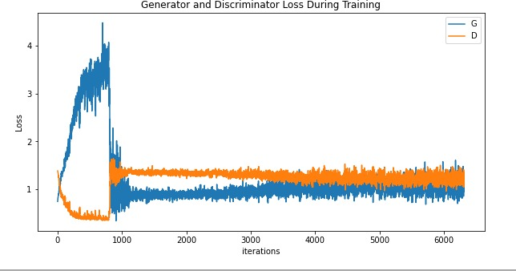
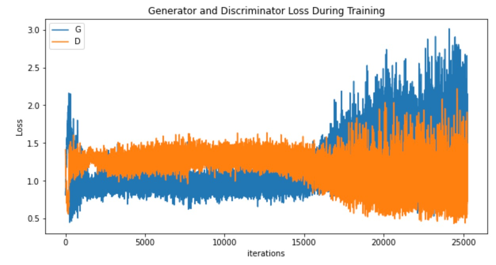

# ML for Music Generation 
# Final Report

- [Introduction](#introduction)
- [Problem Definition](#problem-definition)
- [Dataset](#dataset)
  - [Dataset Creation](#dataset-creation)
  - [Data Preprocessing](#data-preprocessing)
    - [Normalization](#normalization)
    - [Undersampling](#undersampling)
    - [Oversampling using SMOTE](#oversampling-using-smote)
  - [Feature Extraction and Selection](#feature-extraction-and-selection)
    - [Correlation Analysis](#correlation-analysis)
- [Methods](#methods)
    - [Genre Classification (Supervised)](#genre-classification-supervised)
      - [Models Trained](#models-trained)
      - [Model Evaluation](#model-evaluation)
        - [Neural Networks](#neural-networks)
        - [k-Nearest Neighbors](#k-nearest-neighbors)
        - [Decision Trees](#decision-trees)
    - [Music Generation (Unsupervised)](#music-generation-unsupervised)
      - [Models Trained](#models-trained)
      - [Model Evaluation](#model-evaluation)
        - [MidiNet Framework](#midinet-framework)
        - [Genre GAN](#genre-gan)
- [Results and Discussion](#results-and-discussion)
  - [Genre Classification (Supervised)](#genre-classification-supervised)
  - [Music Generation (Unsupervised)](#music-generation-unsupervised)
        - [Challenges](#challenges)
        - [Results](#results)
- [Member Contributions](#member-contributions)
- [References](#references)
- [Project Inspiration](#project-inspiration)

Testing Audio Addition

https://user-images.githubusercontent.com/90489188/144768101-1cf22669-03cb-4511-a948-56ef747250fc.mov

<iframe width="420" height="315" src="https://www.youtube.com/watch?v=mkggXE5e2yk" frameborder="0" allowfullscreen></iframe>

## Introduction 

Content generation is a growing application of Machine Learning, within which Music Generation is a popular task. In this project, we plan to observe musical features in machine learning context and generate tracks specific to existing genres.  

However, music consists of multiple tracks and instruments, and each has its own note sequence or temporal variation, making combination into a single meaningful representation difficult. Musical characteristics are also dependent on genre, so imitating relevant characteristic emotions across genres is challenging.

## Problem Definition 

For this project, our objective is two-fold. One, to characterize music and its styles in the context of machine learning, with the aim of classifying genres, and find the most discriminative features across genres. Two, to generate genre-specific, instrument-only music. We plan to leverage the findings from the former task to aid the latter.

## Dataset

We plan to use symbolic representations of music rather than raw audio. Given the polymorphism of representations in music, the deep learning techniques can be adopted across representations [[Briot]](https://arxiv.org/abs/1709.01620). Out of possible symbolic representations, MIDI is a popular choice. It is a technical standard in music that captures rich information about a song such as tempo, time signatures and key changes across multiple instruments (often more than 25). Therefore, we plan to use this representation for our training data. 

<figure>

   
<figcaption> A Sample MIDI file viewed on GarageBand</figcaption> 

</figure>

Using our dataset, we first plan to identify the best features that discriminate between genres and build a genre classifier using supervised learning techniques on these features. This would help us learn different components that constitute a musical composition and their interaction to develop into a musical style.

### Dataset Creation
Our original goal was to use songs that existed in both the Lakh MIDI Dataset [[LMD]](https://colinraffel.com/projects/lmd/) and the Million Song Dataset [[MSD]](http://millionsongdataset.com/). This intersection of data is provided on the LMD website and will henceforth be referred to as LMD-matched. With this intersection of 45k songs, we would be able to use low-level features from the MIDI files in LMD and the genre labels in MSD. As we investigated further, we realized that within this intersection of 45k songs, an insignificant portion (200) of them had genre labels. Because this wouldn't be nearly enough data to accurately classify 21 different genres, we spent a lot of time brainstorming how to get more labels for our data. We eventually discovered the MSD Allmusic Genre Dataset [[MAGD]](http://www.ifs.tuwien.ac.at/mir/msd/download.html), which provides 422k genre labels for songs in MSD. Using this information, we wrote Python scripts to map MIDI files in LMD-matched to their genres as labeled in MAGD, ignoring any songs that had empty labels or were not present in both LMD and MAGD. With this, we ended up with 37k genre-labeled data points. We then stored this information in a CSV file, with each row representing a MIDI file and its features.

### Data Preprocessing

#### Normalization
While we observed no missing features or labels for the intersection of LMD-Matched and MAGD, we did see that the ranges of values of the features varied significantly. We realized that it is important to normalize features so that the loss functions of the Machine Learning models can give similar importance to all the features. Therefore, we normalized (z-score normalization) each of the features except for pitch histogram features. The pitch-based features already fell in [0,1], and we did not want to lose the absolute importance of notes for a given song by normalizing them across songs. 

<figure>

  
<figcaption>A bar graph of the frequency of songs labeled with a given genre.</figcaption>

</figure>

From this graph, we made the following observations. 

1. We understood that there is a large variance in the number of songs from each genre, with some of the genres having insignificant samples in the dataset. To ensure a good classification, we realised that we need to select genres that have a high significance. To this end, we set a threshold 1000 songs for a genre to be considered as significant enough. Based on this, our final choice of genres were: Pop Rock, Country, Jazz, RnB, Electronic and Latin.

2. The Pop Rock genre makes up an overwhelming majority of the labels. We predicted that when trained on this data, our model would simply classify most songs as Pop Rock because according to its training data, Pop Rock is the most likely answer. This prediction was confirmed in our experiments, which are outlined in the [Model Evaluation](#model-evaluation) section. To combat this one-class domination, we decided to even out our dataset and re-train our model using imbalance mitigation techniques like undersampling and oversampling. 

#### Undersampling

We experimented by decreasing the number of Pop Rock labels in multiple decrements, all the way down to 3,000. Most of these mitigation strategies lead to insignificant improvements in performance. Later, we wanted to test out on a dataset that is perfectly balanced across all genres by including 1170 songs from each genre. This dataset had better results than other undersampled ones, and hence was considered as the main undersampled dataset for our models. 

#### Oversampling using SMOTE

Out of the oversampling techniques we tried, the one that produced the best results was the Synthetic Minority Oversampling Technique [[SMOTE]](https://www.jair.org/index.php/jair/article/view/10302), which oversamples the genres in the minority by repeatedly creating synthetic datapoints using a linear combination of two randomly picked feature vectors from each class. In our case, we oversampled all the genres to 20,581 songs. We felt that SMOTE was most suitable for our situation because our data contains one dominating class and a lot of minority classes. 
We realised that if we only undersample, we lose a lot of valuable data and run the risk of making our dataset too small. With SMOTE as a data augmentation technique, we realised that we can balance our dataset without losing too much information in the process as confirmed in our [Results and Discussion](#results-and-discussion)

We also performed Principal Component Analysis via scikit-learn to reduce our features to two and visualized them below. 

<figure>

  
<figcaption>PCA visualizations for different versions of the dataset</figcaption>

</figure>

PCA was used on three different modifications of our dataset: (1) original dataset with normalized features, (2) undersampled dataset, and (3) oversampled dataset using SMOTE. Although the visualizations do not point to an obvious distinction between genres, we can observe that PCA visualization on the dataset created using SMOTE provides a better distinction between genres that the original or the undersampled dataset. This motivates us to see better results on the SMOTE version of our dataset than others (we discuss this further in the [Model Evaluation](#model-evaluation) section).

### Feature Extraction and Selection

The features explained below were extracted using the [pretty_midi](https://github.com/craffel/pretty-midi)  Python library, which extracts the information directly from the MIDI files. We decided to use these kinds of low-level musical features rather than high-level metadata (such as artist, song title, etc) because this way, we can classify genres based on the specific traits inherent in the actual songs rather than classifying based on who wrote the music. This will provide us with more useful information about the musical distinctions between each genre, which we can then use when building our music generator model.

After observing that humans can identify the genre based on the set of instruments used, the pitch levels of the the instruments and the tempo of the music, we started off by identifying note level information across instruments for each of the genres in consideration. We chose to exclude MIDI Note 42 (F#), as it was the most repeated note across all genres. We believe this note's popularity is due to its presence in G major, one of the most commonly used (and easily learned) keys in modern western music.

<figure>

   
<figcaption>Analysis on Notes: Values plotted are averaged across songs in the genre</figcaption> 

</figure>

As we can observe from the graphs, the genres do not have much differentiability from raw aggregates of the notes information. So we decided to go with a pitch histogram approach as mentioned in [this paper](http://citeseerx.ist.psu.edu/viewdoc/download?doi=10.1.1.107.9375&rep=rep1&type=pdf). The authors propose a method to represent the pitch content of music signals is a symbolic form using histograms. They use a multiple-pitch detection algorithm for generating pitch histograms. We extracted these pitch histograms in our dataset and plotted them. 

<figure>

   
<figcaption>Pitch histograms averaged across genres</figcaption> 

</figure>

As mentioned in the paper and shown above, these pitch histograms encode better information and can act as good features for the task of genre classification. Along with this, we also extracted some features to encode other key information related to temporal aspects of the song. Our final list of features include pitch histogram, MIDI file resolution, number key signatures, tempo changes, length of the song, and tempo, creating a total of 20 different features.

The image below shows the correlation of all the features.

<figure>

  
<figcaption>Correlation between the features used to train our model</figcaption>

</figure>

#### Correlation Analysis
The 12 pitches shown above (in the bottom right portion of the image) are the 12 notes per octave, A, A#, B, C, C#, D, D#, E, F, F#, G and G#. As we can see in the lower right portion, there is a strong correlation between pitches that are 5 semitones (i.e. half-steps, referring to the step that takes a note from A to A#, then A# to B, etc.) apart and 7 semitones apart. This makes sense because these intervals correspond exactly with the concepts of a "perfect fourth" and "perfect fifth" interval in music. These intervals are known to be generally pleasing to the ear, and pairs of notes following these intervals are very commonly used together. Apart from these, we see significant correlation between ts_1 and ts_2 which together specify the time signature of a song. Since they usually take values such as 3/4, 4/4, 6/8 , this correlation is expected. Similarly, we see a slight correlation between number of instruments used and the length of the song (end_time). This is likely because more sophisticated compositions that use more instruments tend to be longer than simpler ones. Apart from these, we see no significant correlations between other pairs of features. 

## Methods  

### Genre Classification (Supervised)

#### Models Trained
We tried various supervised classification techniques in order to determine which was best suited for our data and feature set.

1. SVM model, with One-vs-Rest (OvR) strategy adapted for multiclass classification performed poorly by classifying almost everything as Pop Rock.

2.  Neural Network with varying amounts of layers (from 1 - 3) and neurons (from 5 - 100). With the original dataset without any sort of balancing techniques, the network achieved a 69% accuracy score by classifying almost everything as Pop Rock. However, the F1 score of 14% paints the real picture here. After undersampling and oversampling the data, we applied a 3 * 10-neuron hidden layer neural network with Adam optimization on these versions of the dataset. With this, we obtained a decent performance of 42% F1 score on SMOTE data and 30% F1 score on undersampled data. 

3. A kNN model, which performed well and achieved a 69% F1 score on SMOTE data, although it suffered to perform well on the other two versions of the dataset. We adjusted the hyperparameters for each version individually. 
   
4.  Decision Tree, which performed the best of all five techniques, with the best trial resulting in 75% accuracy and 75% F1 score on SMOTE data. We tried various other data variations like, downsampling the majority class ("Pop Rock"), removing the majority class altogether, or training on the data without any modifications. In all these cases although the Decision Trees we trained usually predicted Pop Rock majorly, their second choice was often the true label. We tuned this model by adjusting parameters such as criterion used for split, max_depth, and max_leaf_nodes.

5.  Random Forest, which performed similarly to the Decision Tree method but with slightly worse results.

#### Model Evaluation
We focus our evaluation and analysis on Neural Networks, kNN and Decision Trees as they had the best results in our study.

##### Neural Networks
We finalized our neural network to have 3 hidden layers with 10 neurons each with Adam optimization, after trying out other architectures and hyperparameters. The image below shows the confusion matrices on three versions of the dataset along with accuracy and F1 scores. 

<figure>

 
 <figcaption>Performance of the neural network on original, undersampled and oversampled datasets</figcaption>

</figure>

As we can see from these matrices, the original dataset lead to a huge overfit (69% accuracy and 14% F1 score). But the performance considerably increased when we undersampled the data to 30% F1 score. It raised further when we used it on the SMOTE data, yielding a F1 score of 42%. 

##### k-Nearest Neighbors
We trained our kNN model on all three versions of dataset and took the most optimal values for n_neighbors for individual versions. These are the confusion matrices and the scores that we obtained:

<figure>

  
<figcaption>Performance of kNN on original, undersampled and oversampled datasets</figcaption>

</figure>

We can see that for the leftmost confusion matrix, the model seems to guess Pop Rock for everything and achieves a good accuracy in doing so. In this case, the accuracy is misleading because the model has not actually learned how to discriminate between genres - it just knows that Pop Rock is the most likely answer because the majority of the data it was trained and tested on was examples of Pop Rock. For the second confusion matrix, we can see that the results look slightly better despite the accuracy being lower. Here, we have undersampled the Pop Rock examples. While the model has now learned more about the characteristics of each genre, the lack of data hinders its understanding, and the model cannot form strong and correct connections. These accuracy and F1 scores are more reflective of the model's actual performance than those in the leftmost confusion matrix because our data here is balanced. For the rightmost confusion matrix, we can see the best results for the kNN model. The use of the oversampling technique both balances the data while also providing the model with a plethora of examples to learn from, thus mitigating the main flaw present in both of the previous models. Interestingly, this model now performs very poorly on Pop Rock music. We believe this could have to do with the quality of our data. Because so many songs were categorized as Pop Rock, it's possible that the "Pop Rock" genre was a catch-all genre for songs that didn't fit anywhere else. This would imply that the songs would have wildly different features, which would make it difficult for the model to determine what it means for a song to be Pop Rock.

##### Decision Trees
We trained the Decision Tree on various versions of the dataset (as described above). The resulting confusion matrices are displayed below.

<figure>

  
<figcaption>Performance of Decision Tree on original, undersampled and oversampled datasets</figcaption>

</figure>

We can very clearly see the improvement as these confusion matrices have more and more examples in the True Positive diagonal. The leftmost confusion matrix represents the results from training the model on the original dataset. We can see that the model guesses Pop Rock for almost everything and achieves a "good" accuracy because the data is mostly Pop Rock, as with the kNN above. The second confusion matrix represents the results for the model being trained on data where we undersampled the Pop Rock genre. We can see that the model was able to learn about other genres better, but the lack of data means that the low F1 score represents our model underfitting the data. Because it has not been provided enough data in its training, the model struggles to find the correct identifying characteristics. The third confusion matrix is the result of training the model on our SMOTE dataset. We can see that here, the model performs very well and is generally able to choose the correct genre. This time, our F1 score is significantly high because we know that the data has been properly balanced with each genre now being equally represented. 

  
<small>Evaluating the learning curve for Decision Tree classifier</small>

In order to evaluate the performance of our Decision Tree Classifier in terms of whether it overfits or underfits, we visualized the learning curves for training and validation splits over a 5-fold cross validation. From the plot above it can be observed that as the number of training samples increase, the training accuracy decreases but the validation accuracy significantly increases. Both training and validation accuracies are reasonably good, suggesting that our model is not underfitting. Also, it can be seen that the two line curves for training and validation scores have not yet reached a convergence. As a result, if we evaluate them on more number of training samples it is highly likely that the gap between them would decrease reflecting that our model also does not overfit. 

### Music Generation (Unsupervised)

We trained a General Adversarial Network (GAN) inspired by [[MidiNet]](https://arxiv.org/abs/1703.10847). Similar to MidiNet, we also implemented a discriminator Convolutional Neural Network (CNN) and a generator CNN. Unlike MidiNet, which seeks to generate music in general, our goal is to generate genre-specific music. Thus, our framework differs in that the discriminator is used to discriminate songs across genres, and the generator uses this information to generate songs in the appropriate genres. For consistency, we used the same songs to train our GAN as we did to train our genre classifier. Based on the feature importance results from our genre classifier, we trained our GAN using features such as the pitches and note duration of each note in each song's melody.

#### Models Trained
We trained various versions of the framework described above in addition to training the [[MidiNet]](https://arxiv.org/abs/1703.10847) architecture itself as a basis for comparison.

1. Deep Convolutional Generative Adversarial Networks with the MidiNet framework. For this, we used approximately 4,000 songs from the dataset provided by MidiNet, a batch size of 36, and 20 epochs. The features used were the melody (an nx1x16x128 matrix representing pianorolls. n is the number of songs, 16 is the number beats in each measure of music, and 128 is the total number of pitches), the underlying chord progression, and random noise. The chord conditions were passed in with the random noise during the discriminator training process. We also experimented with training the framework for a larger number of epochs. Doing so, we observed that it lead to overtraining of the model and so restricted the number of traning epochs to 20.
2. Our GAN was trained on a subset of 6,000 songs from the dataset we used to train our genre classifier with a batch size of 36 and 50 epochs. The features for this included the nx1x16x128 melody matrix of pianorolls, genre labels of the top 13 genres (as a one hot encoding), and random noise. The genres were passed in with random noise when training the discriminator.

#### Model Evaluation

##### MidiNet framework

As we can see in the loss graph below, the GAN proposed by [[MidiNet]](https://arxiv.org/abs/1703.10847) that we trained has both the loss for the discriminator and the loss for the generator converge. We used this graph as a basis of comparison for our loss graphs. From this, we expected spiky loss lines and for the discriminator to have a lower overall loss than the GAN. We also note that in this loss graph, but lines seem to spike during the same iterations, directly showing the relationship between the discriminator and the generator.

<figure>

   
<figcaption>The loss resulting from training the MidiNet GAN</figcaption> 

</figure>

##### Genre GAN

[insert explanation]

<figure>

   
<figcaption>The loss resulting from training our genre GAN</figcaption> 

</figure>

We then tuned our hyperparameters to allow the model to train for 50 epochs. As shown by the graph below, the loss for the discriminator seems to converge, but the loss for the generator follows an increasing pattern. We believe that this is due to overtraining the model and the degradation of our data as the GAN continues to alter it as it trains. 

<figure>

   
<figcaption>The loss resulting from training our genre GAN</figcaption> 

</figure>

This time, we reduced our number of epochs to 20. We can see that towards the beginning of this chart, the losses stay relatively low and then vary wildly in the latter section. However, we can see that the lower extremes of both loss lines display a downward pattern while the upper extremes increase. This is likely caused by [insert explanation]

<figure>

   
<figcaption>The loss resulting from training our genre GAN</figcaption> 

</figure>

## Results and Discussion 

### Genre Classification (Supervised)

Our most successful classifier was our Decision Tree when trained on data that was balanced and oversampled with SMOTE. This classifier achieved an accuracy of 75% and an F1 score of 75%, indicating that the results are fairly reliable. Not only does this classifier correctly classify genres, it does not often confuse one genre for another. Of the model's misclassified genres, the two most common mistakes were predicting Electronic or Latin when the song was actually Pop Rock. This makes sense because Electronic, Latin, and Pop Rock music are all characterized by energetic tempos and strong, rhythmic beats. The two least common mistakes were predicting Country or Electronic for a Jazz song. This once again makes sense because, of the six genres we chose to classify, Jazz has the most unique set of instruments, rhythms, tempo, and notes used. This uniqueness means that the features of Jazz are very easy to distinguish from other genres for both humans and our model.

These results are extremely useful to us. Because our Genre Classifier was trained only on features representing characteristics of the music itself, we now have a very strong understanding of which features to use for our music generation model. Through our work on this model and the results we obtained, we have discovered that data relating to which pitches are used together and how often they are used (as shown in our pitch histograms) in addition to data about the instruments used are integral parts of what makes each genre unique. Using this knowledge of features and their variance across genres, we will build a music generation model that produces genre-specific instrumental music.

### Music Generation (Unsupervised)

#### Challenges

To train our GAN we first had to extract relevant features from our MIDI dataset that would help generate music. To extract these features, we were inspired by the data curation process used in [MIDINet](https://arxiv.org/abs/1703.10847). The very first challenge was that the feature extractor used by MIDINet did not use raw MIDI files as an input to create the musical features. They instead depended on melody and chord matrices directly generated using [TheoryTab]( https://www.hooktheory.com/theorytab). As there was no intersection between our subset of lmd-matched MIDI files and the TheoryTab dataset we could not directly use their script to get the musical features. The next step was to implement the pre-processing suggested in the MIDINet paper directly. This pre-processing was quite involved as we had to perform operations like segmenting a MIDI into bars, shifting notes to two octaves, and generating pianorolls (suggested steps to ensure stability of GAN). We explored the pretty-midi library to help us with this processing but it does not offer a functionality to segment a MIDI. As a workaround we came across [MuseGAN](https://salu133445.github.io/musegan/), which is an extension of MIDINet. Unlike MIDINet their data processing script supports MIDI files using a music processing python library called pypianoroll. We tweaked the script to get musical feature representations (essentially pianorolls) appropriate for the GAN. After playing around with it for a while we realized that the script did not work for our input dataset. One possible reason we thought could have led to this issue is that our MIDI files are not in the format required to be processed by the pypianoroll library. The library is suited for multi-track audio files and our files consist of standard tracks or single-track piano rolls. In the end, we resorted to using the genre information along with single-track piano rolls obtained using pretty-midi to help our GAN generate genre specific audio. 

#### Results

[Insert music samples here]

Because there aren't many technical ways to evaluate how pleasing music is to a human ear, we decided to utilize qualitative data to evaluate our results. The consensus was that [Talk about how "pleasing" the results are.]

## Member Contributions

| Tasks |  Natalie | Shravika | Saurab | Suryatej | Alex  |
|---|---|---|---|---|---|
| Proposal Writing | X | X | X | X | X |
| Finalizing Dataset | X | X |  |  |  |
| Data-Preprocessing, Feature Selection | X | X | X | X |  |
| Designing and Implementing Classification Model | X | X | X | X |  |
| Classification Model Evaluation |   | X | X | X |  |
| Midpoint Report | X | X | X | X |  |
| Model Hyperparameter Tuning |  | X | X | X | X |
| GAN Research | X | X |  | X |  |
| Data Preprocessing for GAN, Feature Selection | X | X |  |  |  |
| MIDI and Audio Generation from GAN Output | X |  | X | X |  |
| Designing and Implementing GAN | X | X | X | X |  |
| Generation Model Evaluation |  |  | X | X |  |
| Final Report | X | X | X | X |  |
| Final Video Presentation |  X | X | X | X |  |

## References
1. [YangEval] Yang, L. C., & Lerch, A. (2020). On the evaluation of generative models in music. Neural Computing and Applications, 32(9), 4773-4784. 
2. [MelodyRNN] https://github.com/magenta/magenta/tree/main/magenta/models/melody_rnn 
3. [WaveNet] Oord, A. V. D., Dieleman, S., Zen, H., Simonyan, K., Vinyals, O., Graves, A., ... & Kavukcuoglu, K. (2016). Wavenet: A generative model for raw audio. arXiv preprint arXiv:1609.03499. 
4. [MuseGAN] Dong, H. W., Hsiao, W. Y., Yang, L. C., & Yang, Y. H. (2018, April). Musegan: Multi-track sequential generative adversarial networks for symbolic music generation and accompaniment. In Thirty-Second AAAI Conference on Artificial Intelligence. 
5. [MidiNet] Yang, L. C., Chou, S. Y., & Yang, Y. H. (2017). Midinet: A convolutional generative adversarial network for symbolic-domain music generation. arXiv preprint arXiv:1703.10847. 
6. [LMD] Raffel, C. The Lakh MIDI Dataset v0.1. [Link](https://colinraffel.com/projects/lmd/)
7. [MSD] Bertin-Mahieux, T., Ellis, D. P., Whitman, B., & Lamere, P. (2011). The million song dataset.
8. [Briot] Briot, J. P., Hadjeres, G., & Pachet, F. D. (2017). Deep learning techniques for music generation--a survey. arXiv preprint arXiv:1709.01620.
9. [MAGD] Schindler, A., Mayer, R., & Rauber, A. The MSD Allmusic Genre Dataset. [Link](http://www.ifs.tuwien.ac.at/mir/msd/download.html)

## Project Inspiration
1. https://www.news.gatech.edu/news/2017/06/13/robot-uses-deep-learning-and-big-data-write-and-play-its-own-music 
2. https://openai.com/blog/jukebox/
3. http://www-desir.lip6.fr/~briot/cours/unirio/Transparents/dlmg-4-autoencoder.pdf 
4. https://arxiv.org/pdf/1709.01620 
5. https://hal.sorbonne-universite.fr/hal-01840937/document 
6. https://arxiv.org/pdf/1703.10847.pdf 
7. https://link.springer.com/content/pdf/10.1007/s00521-020-05399-0.pdf 
8. https://ieeexplore.ieee.org/abstract/document/8334500 
9. https://www.aaai.org/ocs/index.php/AAAI/AAAI18/paper/view/17286/15668 
10. https://musicinformatics.gatech.edu/wp-content_nondefault/uploads/2018/11/postprint.pdf 
11. https://arxiv.org/pdf/1910.09242.pdf (mapping genres to Lakh MIDI dataset) 
12. https://drive.google.com/file/d/1dvlZ5A7HiJIS9nkc6YWutBXbpNze2u8K/view 
13. https://magenta.tensorflow.org 
14. https://nbviewer.jupyter.org/github/craffel/midi-ground-truth/blob/master/Statistics.ipynb 
15. https://www.skoove.com/blog/time-signatures-explained/ [On time signature] 
16. https://salu133445.github.io/musegan/ 
17. https://github.gatech.edu/pages/mthomas362/midi-ml/
